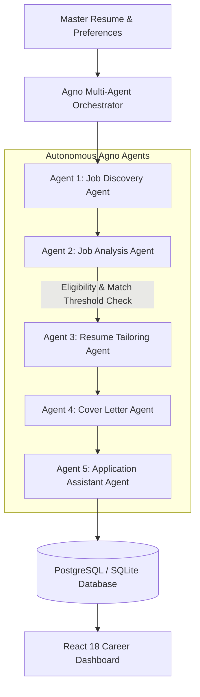

# Resumio — Autonomous AI Resume & Bulk Job Application Engine 🚀

Resumio is an enterprise-grade, full-stack AI career platform upgraded with **Agno Multi-Agent Orchestration**. It empowers job seekers to discover matching opportunities, evaluate ATS compatibility, generate role-specific tailored resumes & cover letters, and track applications autonomously at scale.

---

## 🌟 Agno Multi-Agent Architecture

Resumio incorporates 5 specialized **Agno AI Agents** managed by an asynchronous, deterministic orchestrator:



### 🤖 The 5 Specialized Agno Agents:
1. **Job Discovery Agent (`JobDiscoveryAgent`)**:
   - Searches, extracts, and normalizes job listings across supported feeds and public APIs (RemoteOK, curated software engineering feeds).
   - Standardizes titles, compensation, locations, work arrangements, and technical requirements with duplicate detection.
2. **Job Analysis Agent (`JobAnalysisAgent`)**:
   - Compares target job descriptions with the candidate's master resume.
   - Computes realistic ATS match scores (0-100), extracts verified matching skills, flags missing keywords, and validates strict eligibility rules (years of experience, degrees).
3. **Resume Tailoring Agent (`ResumeTailoringAgent`)**:
   - Crafts individualized, ATS-optimized resume snapshots tailored to specific job specifications.
   - Restructures summary and technical skills buckets; rewrites experience & project bullets using Google XYZ format (*"Accomplished [X] as measured by [Y] by doing [Z]"*).
   - Preserves truthful candidate background without ever fabricating false employment history.
4. **Cover Letter Agent (`CoverLetterAgent`)**:
   - Generates authentic, high-converting cover letters matching candidate experience to the employer's core challenges.
5. **Application Assistant Agent (`ApplicationAssistantAgent`)**:
   - Prepares and validates complete application packages (tailored resume + cover letter + candidate metadata + external posting URL) and requires human confirmation before status dispatch.

---

## 🛠️ Tech Stack

- **AI Framework**: [Agno](https://github.com/agno-agi/agno) v3.1.2 + Groq LLM Provider (`openai/gpt-oss-20b`, `llama-3.3-70b-versatile`)
- **Backend**: Python 3.10+ FastAPI, SQLAlchemy ORM, Pydantic v2, PostgreSQL / Supabase with local SQLite fallback, OAuth2 + JWT authentication, bcrypt password hashing.
- **Frontend**: React 18, Vite, Tailwind CSS, Lucide React, Axios, html2pdf.js / jsPDF.
- **Testing**: Python AsyncIO test suite (`backend/tests/test_agents.py`).

---

## ⚡ Key Modules & Features

- **Master Resume Editor (`/editor`)**: Real-time dual-pane editor with 4 ATS templates (Academic LaTeX, Modern Minimal, Executive Slate, Creative Two-Column) and crisp single-page PDF exports.
- **Job Opportunities Hub (`/jobs`)**: Search listings, filter by remote/hybrid, run instant Agno ATS analysis, and tailor resumes with 1-click.
- **Bulk AI Application Hub (`/bulk-processing`)**: Launch batch runs (10 to 50 jobs) with bounded concurrency, pause/resume/cancel controls, and real-time progress bars.
- **Applications Tracker (`/applications`)**: Pipeline tracking from *Ready to Apply* through *Applied*, *Interviewing*, *Offered*, and *Archived*.
- **Cover Letters Studio (`/cover-letters`)**: Dedicated editor with 1-click clipboard copy, `.txt` download, and print/PDF export.
- **Job ATS Optimizer (`/optimize-job`)**: Custom JD gap analyzer and bullet optimizer.
- **Quick AI Edit (`/quick-edit`)**: Natural language resume modifier.
- **Version History (`/versions`)**: Timestamped snapshots and role-specific versions with instant restore.

---

## 🚀 Quick Start Guide

### 1. Backend Setup
```bash
cd backend

# Create & activate virtual environment
python -m venv venv
.\venv\Scripts\activate   # Windows
# source venv/bin/activate # macOS/Linux

# Install dependencies
pip install -r requirements.txt

# Configure environment variables
# Copy .env.example to .env and set your GROQ_API_KEY
```

Run tests to verify Agno agents:
```bash
python tests/test_agents.py
```

Start FastAPI development server:
```bash
uvicorn main:app --reload --port 8000
```

### 2. Frontend Setup
```bash
cd frontend

# Install dependencies
npm install

# Start Vite dev server
npm run dev
```
Open [http://localhost:5173](http://localhost:5173) in your browser.

---

## 🧪 Integration Testing Output
```
--- Running Agno Multi-Agent Integration Tests ---

[1/5 PASSED] JobAnalysisAgent: Match Score 95% (High Match for Senior Backend Role)
[2/5 PASSED] ResumeTailoringAgent: Summary tailored
[3/5 PASSED] CoverLetterAgent: Letter generated for Stratos Cloud
[4/5 PASSED] ApplicationAssistantAgent: Application Package Verified
[5/5 PASSED] AgnoOrchestrator: Full 5-stage pipeline executed successfully!

ALL AGNO MULTI-AGENT TESTS PASSED SUCCESSFULLY!
```

---

## 📄 License
MIT License.
